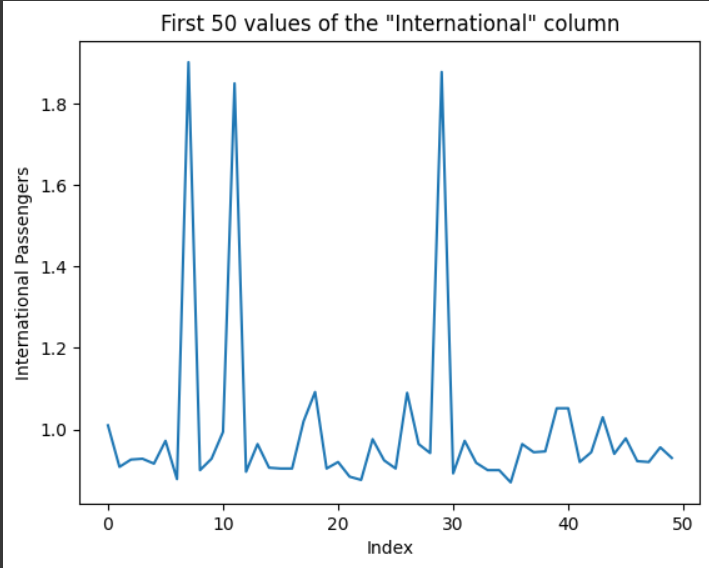
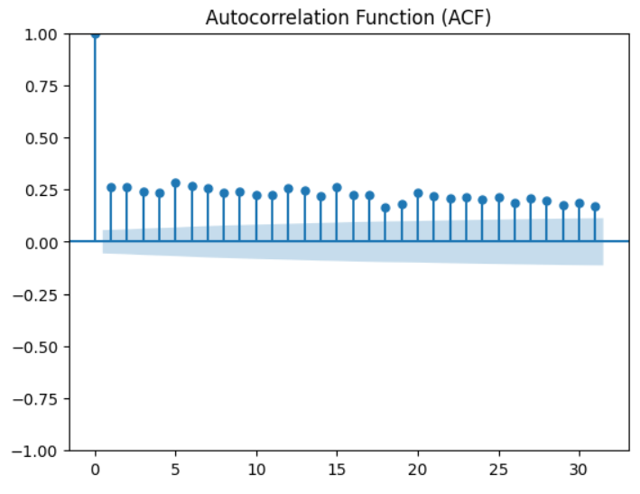
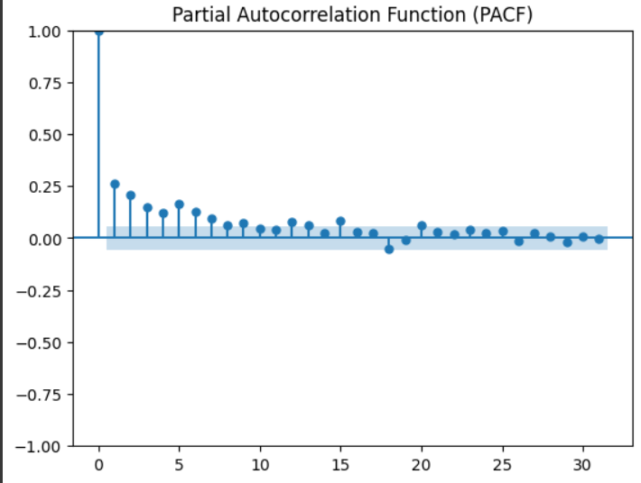
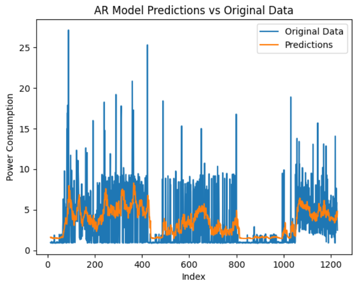

# Ex.No: 08     MOVINTG AVERAGE MODEL AND EXPONENTIAL SMOOTHING
### Date: 
### Developed By: Shaik Shoaib Nawaz
### Register No: 212222240094


### AIM:
To implement Moving Average Model and Exponential smoothing Using Python.
### ALGORITHM:
1. Import necessary libraries
2. Read the electricity time series data from a CSV file,Display the shape and the first 20 rows of
the dataset
3. Set the figure size for plots
4. Suppress warnings
5. Plot the first 50 values of the 'Value' column
6. Perform rolling average transformation with a window size of 5
7. Display the first 10 values of the rolling mean
8. Perform rolling average transformation with a window size of 10
9. Create a new figure for plotting,Plot the original data and fitted value
10. Show the plot
11. Also perform exponential smoothing and plot the graph
### PROGRAM:
```
import numpy as np
import pandas as pd
import matplotlib.pyplot as plt
from statsmodels.tsa.stattools import adfuller
from statsmodels.graphics.tsaplots import plot_acf, plot_pacf
from statsmodels.tsa.ar_model import AutoReg
from sklearn.metrics import mean_squared_error
data = pd.read_csv("/content/KwhConsumptionBlower78_1.csv")
print("Shape of the dataset:", data.shape)
print("First 50 rows of the dataset:")
print(data.head(50))
plt.plot(data['Consumption'].head(50))
plt.title('First 50 values of the "International" column')
plt.xlabel('Index')
plt.ylabel('International Passengers')
plt.show()
rolling_mean_5 = data['Consumption'].rolling(window=5).mean()
print("First 10 values of the rolling mean with window size 5:")
print(rolling_mean_5.head(10))
rolling_mean_10 = data['Consumption'].rolling(window=10).mean()
plt.plot(data['Consumption'], label='Original Data')
plt.plot(rolling_mean_10, label='Rolling Mean (window=10)')
plt.title('Original Data and Fitted Value (Rolling Mean)')
plt.xlabel('Index')
plt.ylabel('Power Consumption')
plt.legend()
plt.show()
lag_order = 13
model = AutoReg(data['Consumption'], lags=lag_order)
model_fit = model.fit()
plot_acf(data['Consumption'])
plt.title('Autocorrelation Function (ACF)')
plt.show()

plot_pacf(data['Consumption'])
plt.title('Partial Autocorrelation Function (PACF)')
plt.show()
predictions = model_fit.predict(start=lag_order, end=len(data)-1)
mse = mean_squared_error(data['Consumption'][lag_order:], predictions)
print('Mean Squared Error (MSE):', mse)
plt.plot(data['Consumption'][lag_order:], label='Original Data')
plt.plot(predictions, label='Predictions')
plt.title('AR Model Predictions vs Original Data')
plt.xlabel('Index')
plt.ylabel('Power Consumption')
plt.legend()
plt.show()

```

### OUTPUT:

#### original data and fitted value :


#### Plot Partial Autocorrelation Function (PACF) and Autocorrelation Function (ACF) :



#### Plot the original data and predictions :



### RESULT:
Thus we have successfully implemented the Moving Average Model and Exponential smoothing using python.
